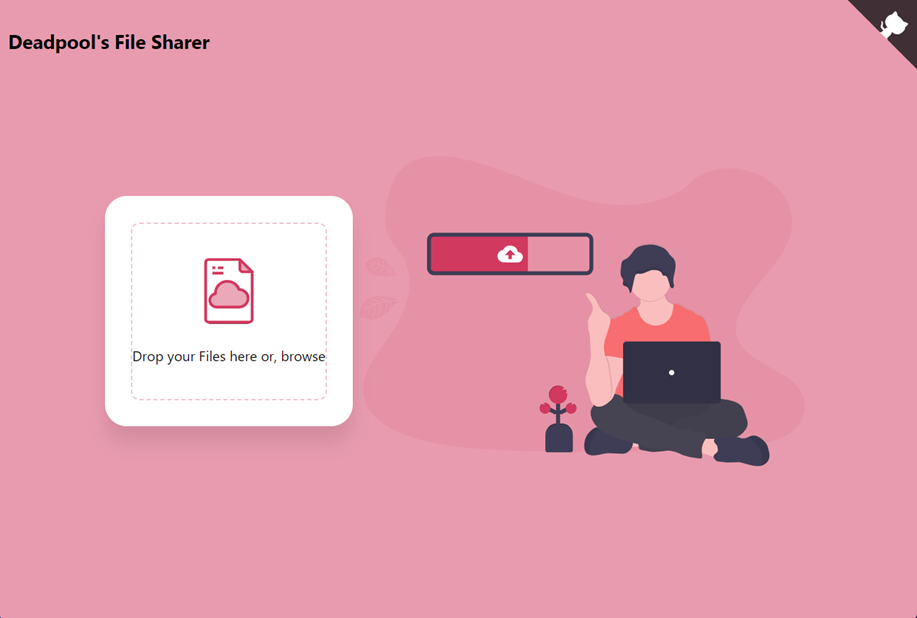

# Deadpool's File Sharer

Deadpool's File Sharer is a simple file-sharing web application developed using Express.js, Node.js, MongoDB, and basic HTML/CSS.

## User Interface

## Overview

This application allows users to upload files, generate shareable links, and optionally share files via email. The file links are set to expire after 24 hours.

## Features

- **File Upload**: Users can upload files by dragging and dropping or using the browse button.
- **Progress Tracking**: Real-time progress tracking during file upload.
- **File Sharing Link**: Generates a unique link for each uploaded file, which expires after 24 hours.
- **Copy to Clipboard**: Provides an option to copy the file sharing link to the clipboard.
- **Email Sharing**: Allows users to share files by sending them via email.
- **Responsive Design**: User-friendly design that adapts to different screen sizes.

## Technologies Used

- **Express.js**: Handles server-side routing and logic.
- **Node.js**: Powers the backend of the application.
- **MongoDB**: Stores information about the uploaded files (not the files themselves).
- **HTML/CSS**: Provides the basic structure and styling of the web pages.
- **JavaScript (Client-Side)**: Manages client-side interactions and AJAX requests.
- **File Upload**: Uses `express-fileupload` middleware for handling file uploads.

## File Structure

- **HTML**: Contains `index.html` for the front-end structure.
- **CSS**: Styles are defined in `style.css`.
- **JavaScript**: The client-side logic is in `script.js`.
- **Server (Node.js)**: The server-side logic is in the `script.js` file.
- **Images**: Icons and images used in the application.

## Usage

1. Ensure that MongoDB is running locally or update the database connection in the server file accordingly.
2. Install the necessary Node.js packages using `npm install`.
3. Start the server using `node script.js` or `npm start`.
4. Access the application through a web browser at `http://localhost:3000`.

## How to Use

1. Drag and drop files onto the designated area or use the "Browse" button to select files.
2. Track the upload progress with the progress bar.
3. Once uploaded, a sharing link is generated, which can be copied to the clipboard.
4. Optionally, fill in email details and click "Send" to share the file via email.
5. The sharing link is set to expire after 24 hours.

## Acknowledgments

This project uses the GitHub Corner by [Simon Whitaker](https://github.com/simonwhitaker/github-fork-ribbon-css).